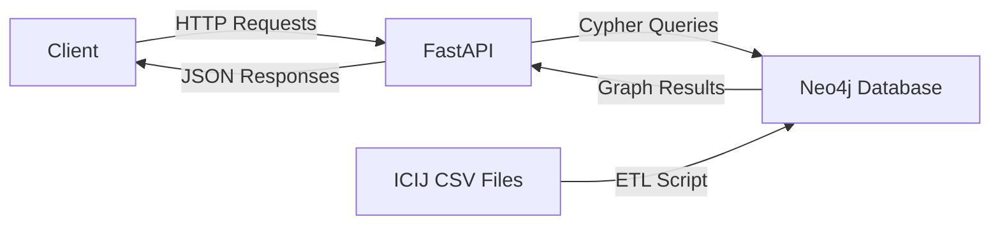

# Offshore Graph Analysis API

A FastAPI-based API for analyzing offshore financial data from ICIJ Offshore Leaks using Neo4j graph database. This application enables detection of beneficial ownership patterns, money laundering risks, and suspicious network structures in offshore financial networks.

## Architecture



## Tech Stack

- **Python 3.11+** - Programming language
- **FastAPI** - Modern, fast web framework for building APIs
- **Neo4j 5 Community** - Graph database for relationship analysis
- **Docker & Docker Compose** - Containerization and orchestration
- **Pandas** - Data processing for ETL operations
- **Pydantic** - Data validation and settings management
- **Pytest** - Testing framework

## Project Structure

```
project-offshore-graph/
├── docker-compose.yml          # Docker orchestration (Neo4j + FastAPI)
├── Dockerfile                  # FastAPI container definition
├── .env.example               # Environment variables template
├── .gitignore                 # Git ignore rules
├── Makefile                   # Development commands
├── README.md                  # This file
├── requirements.txt            # Python dependencies
├── graph_eda.ipynb            # Jupyter notebook for EDA
│
├── Data/                      # ICIJ CSV data files (gitignored)
│   ├── nodes-entities.csv
│   ├── nodes-officers.csv
│   ├── nodes-intermediaries.csv
│   ├── nodes-addresses.csv
│   └── relationships.csv
│
├── app/                       # Main application code
│   ├── __init__.py
│   ├── main.py                # FastAPI application entry point
│   ├── config.py              # Configuration management (Pydantic)
│   ├── database.py            # Neo4j connection manager (Singleton)
│   │
│   ├── models/                # Pydantic response models
│   │   └── __init__.py        # API response schemas
│   │
│   ├── routers/               # API endpoint handlers
│   │   ├── __init__.py
│   │   ├── entities.py        # Entity-related endpoints
│   │   └── networks.py        # Network analysis endpoints
│   │
│   └── services/              # Business logic layer
│       ├── __init__.py
│       └── graph_service.py   # Cypher query service
│
├── scripts/                    # Utility scripts
│   └── seed_data.py           # ETL script (CSV → Neo4j)
│
└── tests/                     # Test suite
    ├── __init__.py
    └── test_api.py            # API endpoint tests
```

## Prerequisites

1. **Docker & Docker Compose** installed on your system
2. **ICIJ CSV Files** placed in the `Data/` directory:
   - `nodes-entities.csv`
   - `nodes-officers.csv`
   - `nodes-intermediaries.csv`
   - `nodes-addresses.csv`
   - `relationships.csv`

## Setup Instructions

### Step 1: Prepare Data Files

Place your ICIJ CSV files in the `Data/` directory (or `data/` - both are supported).

### Step 2: Build and Run Services

```bash
# Build Docker images
make docker-build

# Start Neo4j and FastAPI services
make docker-run

# Or use docker-compose directly:
docker-compose up --build
```

This will start:
- **Neo4j** on `http://localhost:7474` (Browser) and `bolt://localhost:7687` (Bolt)
- **FastAPI** on `http://localhost:8000`

### Step 3: Load Data into Neo4j

```bash
# Run the ETL script to load CSV data
make seed

# Or manually:
python scripts/seed_data.py
```

The script will:
- Process CSV files in chunks (10,000 rows at a time)
- Create nodes: Entity, Officer, Intermediary, Address, Jurisdiction
- Create relationships: OFFICER_OF, INTERMEDIARY_OF, REGISTERED_ADDRESS, REGISTERED_IN
- Display summary statistics upon completion

### Step 4: Verify Setup

```bash
# Check API health
curl http://localhost:8000/health

# Access API documentation
open http://localhost:8000/docs
```

## API Documentation

### Base URL
```
http://localhost:8000
```

### Endpoints

#### 1. Root & Health

- **GET /** - Welcome message and API information
- **GET /health** - Health check with Neo4j connectivity status

#### 2. Entity Endpoints

**GET `/api/entities/{entity_id}/ownership/paths`**

Trace ownership paths from Officers to a specific Entity.

**Parameters:**
- `entity_id` (path) - The ID of the target entity
- `max_length` (query, optional) - Maximum path length (1-10, default: 5)

**Example:**
```bash
curl "http://localhost:8000/api/entities/10000001/ownership/paths?max_length=4"
```

**Response:**
```json
[
  {
    "nodes": [
      {"id": "12000001", "labels": ["Officer"], "properties": {...}},
      {"id": "10000001", "labels": ["Entity"], "properties": {...}}
    ],
    "relationships": [
      {"type": "OFFICER_OF", "start_node": "12000001", "end_node": "10000001", "properties": {}}
    ],
    "length": 1
  }
]
```

#### 3. Network Analysis Endpoints

**GET `/api/networks/intermediaries/top`**

Find intermediaries connected to the most entities (network hubs).

**Parameters:**
- `limit` (query, optional) - Number of results (1-100, default: 10)

**Example:**
```bash
curl "http://localhost:8000/api/networks/intermediaries/top?limit=20"
```

**Response:**
```json
[
  {
    "intermediary_id": "11000001",
    "intermediary_name": "Mossack Fonseca",
    "entity_count": 50000
  }
]
```

**GET `/api/networks/redflags`**

Detect suspicious clusters - addresses with multiple registered entities (potential shell company rings).

**Parameters:**
- `min_entities` (query, optional) - Minimum entities per address (≥2, default: 2)
- `limit` (query, optional) - Maximum results (1-200, default: 50)

**Example:**
```bash
curl "http://localhost:8000/api/networks/redflags?min_entities=10&limit=20"
```

**Response:**
```json
[
  {
    "address_id": "24000001",
    "address": "P.O. BOX N-4805, NASSAU, BAHAMAS",
    "entity_count": 150,
    "entities": [
      {"id": "", "name": "Entity Name 1", "jurisdiction": null, "node_type": "Entity"}
    ]
  }
]
```

### Interactive API Documentation

Visit `http://localhost:8000/docs` for Swagger UI with interactive API testing.

## Graph Data Model

### Node Types

- **Entity** - Offshore entities (companies, trusts, foundations)
  - Properties: `id`, `name`, `source`, `node_type`
- **Officer** - Officers/directors of entities
  - Properties: `id`, `name`, `source`, `node_type`
- **Intermediary** - Service providers (law firms, corporate service providers)
  - Properties: `id`, `name`, `source`, `node_type`
- **Address** - Physical addresses
  - Properties: `id`, `address`, `source`, `node_type`
- **Jurisdiction** - Jurisdictions (countries/regions)
  - Properties: `name`

### Relationship Types

- `(:Officer)-[:OFFICER_OF]->(:Entity)` - Officer relationship to entity
- `(:Intermediary)-[:INTERMEDIARY_OF]->(:Entity)` - Intermediary relationship to entity
- `(:Entity)-[:REGISTERED_ADDRESS]->(:Address)` - Entity address registration
- `(:Entity)-[:REGISTERED_IN]->(:Jurisdiction)` - Entity jurisdiction registration

## Development

### Local Development Setup

```bash
# Create virtual environment
make venv

# Install dependencies
make install

# Run FastAPI locally (requires Neo4j running)
make run

# Run data ingestion
make seed
```

### Environment Variables

Create a `.env` file (or use `.env.example` as template):

```env
NEO4J_URI=bolt://localhost:7687
NEO4J_USER=neo4j
NEO4J_PASSWORD=password
API_HOST=0.0.0.0
API_PORT=8000
ENVIRONMENT=development
```

### Testing

```bash
# Run tests
pytest

# Run with coverage
pytest --cov=app tests/
```

### Code Quality

```bash
# Format code
black app/ scripts/ tests/

# Lint code
flake8 app/ scripts/ tests/

# Type checking
mypy app/
```

## Exploratory Data Analysis

A Jupyter notebook (`graph_eda.ipynb`) is provided for exploratory data analysis:

1. **Connection Setup** - Connect to Neo4j database
2. **Basic Statistics** - Count nodes by type
3. **Jurisdiction Analysis** - Top jurisdictions by entity count with visualizations
4. **Risk Analysis** - Identify high-risk addresses (red flags)

To run the notebook:

```bash
# Install Jupyter
pip install jupyter matplotlib

# Start Jupyter
jupyter notebook graph_eda.ipynb
```

## Use Cases

1. **Beneficial Ownership Tracing** - Trace ownership paths from officers to entities
2. **Network Hub Detection** - Identify intermediaries managing many entities
3. **Risk Assessment** - Detect suspicious patterns (shell company rings, address clustering)
4. **Compliance** - Support AML (Anti-Money Laundering) investigations

## Team

- [Team Member 1] - Role/Contribution
- [Team Member 2] - Role/Contribution
- [Team Member 3] - Role/Contribution

## License

[Specify License]

## Acknowledgments

- ICIJ (International Consortium of Investigative Journalists) for the Offshore Leaks database
- Neo4j for the graph database platform
- FastAPI for the modern web framework

## Support

For issues or questions, please open an issue in the repository or contact the development team.
