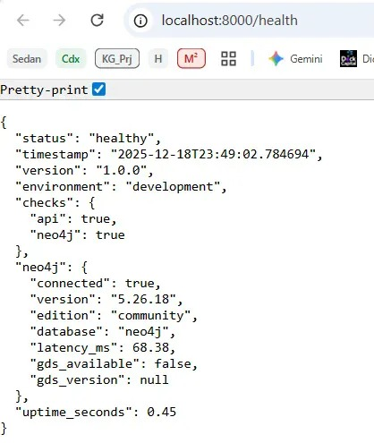
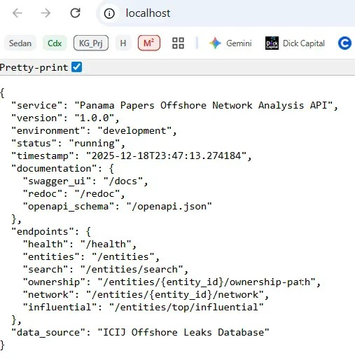
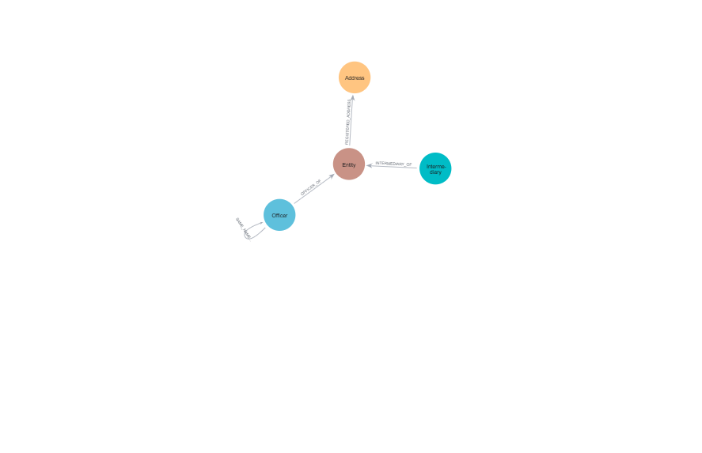
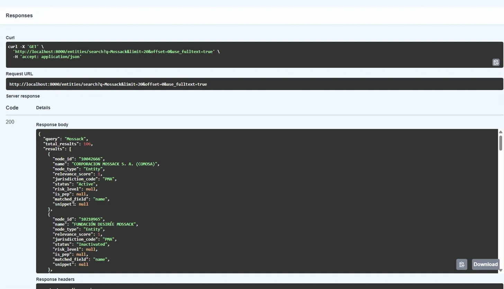
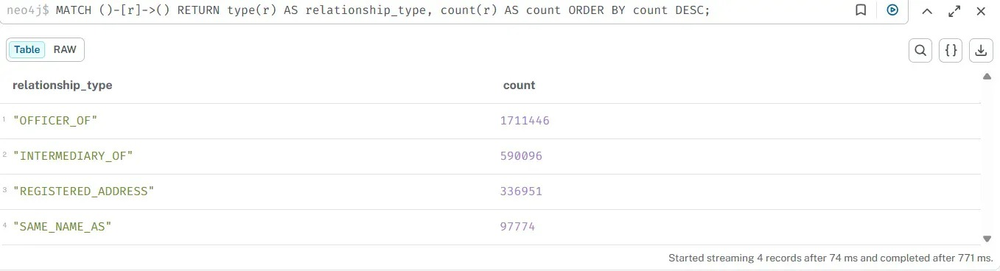

# Panama Papers Offshore Financial Network Analysis

A Neo4j-powered API for analyzing beneficial ownership structures in the ICIJ Panama Papers dataset.
Enables investigation of offshore financial networks, intermediaries, and complex business ownership patterns.

**Data Source:** [ICIJ Offshore Leaks Database](https://offshoreleaks.icij.org/)

---

## Features

- 🔍 **Beneficial Ownership Tracing** — Follow ownership chains through complex corporate structures up to 6 hops deep

  
  
  *A visual representation of an ownership network within the Neo4j Browser. This screenshot displays a multi-hop path unmasking the ultimate human controller behind nested shell companies.*

- 📊 **Network Analysis** — Identify influential entities using PageRank, betweenness centrality, and degree metrics

  
  
  *Results from PageRank and Louvain algorithms running on the graph. This highlights the most influential intermediaries and detected communities within the offshore network.*

- 🏘️ **Community Detection** — Discover connected business networks using Louvain clustering and label propagation
- 🚩 **Red Flag Detection** — Automatic identification of suspicious patterns (deep layering, PEP connections, circular ownership)
- ⚡ **Fast Query Performance** — Optimized Cypher queries with proper indexing and bounded variable-length paths
- 🔐 **REST API** — FastAPI with OpenAPI/Swagger documentation and Pydantic validation
- 🐳 **Containerized Deployment** — Docker Compose setup with Neo4j, FastAPI, and optional Nginx reverse proxy

---

## Data Model



*A logical data model of the Panama Papers network created in draw.io. It defines the properties and relationships between Entity, Officer, Intermediary, and Address nodes.*

---

## Technology Stack

| Component | Technology | Version |
|-----------|------------|---------|
| **Database** | Neo4j Enterprise/Community | 5.17+ |
| **Graph Analytics** | Neo4j Graph Data Science (GDS) | 2.6+ |
| **Backend Framework** | FastAPI | 0.109+ |
| **Runtime** | Python | 3.11+ |
| **Async Driver** | neo4j-driver | 5.17+ |
| **Validation** | Pydantic | 2.6+ |
| **Testing** | Pytest + pytest-asyncio | 8.0+ |
| **HTTP Client** | HTTPX | 0.27+ |
| **Containerization** | Docker + Docker Compose | 24.0+ |
| **Reverse Proxy** | Nginx | 1.25+ |
| **Code Quality** | Pylint, Black, isort | Latest |

---

## Usage



*The interactive Swagger UI showcasing operational REST endpoints. This demonstrates the API's ability to execute complex graph traversals and beneficial ownership lookups.*

---

## Quick Start

### Prerequisites

- **Docker** & **Docker Compose** (v2.0+)
- **Git**
- (Optional) **Python 3.11+** for local development
- (Optional) **Make** for build automation

### Installation

1. **Clone repository:**
   ```bash
   git clone https://github.com/yourteam/panama-papers-analysis.git
   cd panama-papers-analysis
   ```

2. **Setup environment:**
   ```bash
   cp .env.example .env
   ```
   
   Edit `.env` with your configuration:
   ```env
   # Neo4j Configuration
   NEO4J_URI=bolt://neo4j:7687
   NEO4J_USER=neo4j
   NEO4J_PASSWORD=your_secure_password
   NEO4J_DATABASE=neo4j
   
   # API Configuration
   API_ENV=development
   API_HOST=0.0.0.0
   API_PORT=8000
   ```

3. **Start services:**
   ```bash
   docker-compose up -d
   ```
   
   Or using Make:
   ```bash
   make docker-run
   ```

4. **Wait for Neo4j to initialize** (first run takes ~60 seconds):
   ```bash
   docker-compose logs -f neo4j
   # Wait for: "Started."
   ```

5. **Verify setup:**
   ```bash
   # Health check
   curl http://localhost:8000/health
   
   # Swagger UI
   open http://localhost:8000/docs
   ```

6. **Import ICIJ data (optional):**
   ```bash
   # Download data from ICIJ
   wget https://offshoreleaks.icij.org/pages/database -O data/
   
   # Run import script
   make seed-db
   # Or: python scripts/seeddata.py --data-dir ./data
   ```

### Verify Everything is Working

```bash
# Check API health
curl -s http://localhost:8000/health | jq

# Expected output:
{
  "status": "healthy",
  "checks": {
    "api": true,
    "neo4j": true
  },
  "neo4j": {
    "connected": true,
    "version": "5.17.0",
    "edition": "community"
  }
}
```

---

## Project Structure

```
panama-papers-analysis/
├── app/
│   ├── __init__.py
│   ├── main.py               # FastAPI application factory
│   ├── database.py           # Neo4j async driver & connection management
│   ├── models.py             # Pydantic models for request/response validation
│   └── routes/
│       ├── __init__.py
│       ├── entities.py       # Entity CRUD & search endpoints
│       └── network.py        # Network analysis endpoints
│
├── scripts/
│   ├── panama-papers-schema.cypher   # Neo4j schema (constraints, indexes)
│   ├── seeddata.py                   # ICIJ CSV data import script
│   ├── gds_setup.cypher              # GDS algorithm configuration
│   └── analysis_queries.cypher       # Example investigative queries
│
├── tests/
│   ├── __init__.py
│   ├── conftest.py           # Pytest fixtures & async configuration
│   ├── test_entities.py      # Entity endpoint tests
│   └── test_network.py       # Network analysis tests
│
├── docs/
│   ├── neo4j-panama-papers-schema.md     # Graph schema documentation
│   └── panama-papers-system-architecture.md  # System architecture
│
├── docker/
│   ├── Dockerfile            # FastAPI container
│   ├── Dockerfile.neo4j      # Custom Neo4j with GDS plugins
│   └── nginx.conf            # Nginx reverse proxy config
│
├── docker-compose.yml        # Multi-service orchestration
├── docker-compose.prod.yml   # Production overrides
├── Makefile                  # Build automation
├── requirements.txt          # Production dependencies
├── requirements-dev.txt      # Development dependencies
├── pyproject.toml            # Project metadata & tool config
├── .env.example              # Environment template
├── .pylintrc                 # Pylint configuration
├── .gitignore
├── LICENSE
└── README.md                 # This file
```

### Directory Descriptions

| Directory | Purpose |
|-----------|---------|
| `app/` | FastAPI application code (routes, models, database) |
| `scripts/` | Database setup, data import, and analysis scripts |
| `tests/` | Pytest test suite with async fixtures |
| `docs/` | Architecture and schema documentation |
| `docker/` | Container configurations |

---

## API Documentation

### Base URL

```
http://localhost:8000
```

### Interactive Documentation

| URL | Description |
|-----|-------------|
| `/docs` | Swagger UI (interactive) |
| `/redoc` | ReDoc (readable) |
| `/openapi.json` | OpenAPI 3.0 schema |

---

### Endpoints Reference

#### Health & Status

##### GET /health
System health check with Neo4j connectivity status.

```bash
curl -X GET "http://localhost:8000/health"
```

**Response:**
```json
{
  "status": "healthy",
  "timestamp": "2024-01-15T10:30:00Z",
  "version": "1.0.0",
  "checks": {
    "api": true,
    "neo4j": true
  },
  "neo4j": {
    "connected": true,
    "version": "5.17.0",
    "latency_ms": 12.5,
    "gds_available": true
  }
}
```

---

#### Entity Operations

##### GET /entities/{entity_id}
Retrieve entity details by ID.

```bash
curl -X GET "http://localhost:8000/entities/10000001" \
  -H "Accept: application/json"
```

**Response:**
```json
{
  "entity_id": "10000001",
  "name": "DORADO MANAGEMENT INC.",
  "jurisdiction_code": "PAN",
  "entity_type": "Company",
  "status": "Active",
  "incorporation_date": "2005-03-15",
  "pagerank_score": 0.0234,
  "community_id": 142,
  "degree_centrality": 8
}
```

**Error Response (404):**
```json
{
  "status_code": 404,
  "error": "Entity not found",
  "detail": "Entity with ID '99999999' not found",
  "timestamp": "2024-01-15T10:30:00Z"
}
```

---

##### GET /entities/search
Search entities by name with filters.

**Parameters:**
| Parameter | Type | Required | Default | Description |
|-----------|------|----------|---------|-------------|
| `q` | string | Yes | - | Search query (min 2 chars) |
| `jurisdiction` | string | No | - | Filter by jurisdiction code |
| `entity_type` | string | No | - | Filter by type (Company, Trust, etc.) |
| `status` | string | No | - | Filter by status (Active, Dissolved) |
| `limit` | integer | No | 20 | Results per page (1-100) |
| `offset` | integer | No | 0 | Pagination offset |

```bash
curl -X GET "http://localhost:8000/entities/search?q=Holdings&jurisdiction=BVI&limit=10"
```

**Response:**
```json
{
  "query": "Holdings",
  "total_results": 1547,
  "results": [
    {
      "node_id": "10000125",
      "name": "ALPHA HOLDINGS LTD",
      "node_type": "Entity",
      "relevance_score": 0.95,
      "jurisdiction_code": "BVI",
      "status": "Active"
    },
    {
      "node_id": "10000892",
      "name": "BETA HOLDINGS SA",
      "node_type": "Entity",
      "relevance_score": 0.88,
      "jurisdiction_code": "BVI",
      "status": "Active"
    }
  ],
  "limit": 10,
  "offset": 0,
  "has_more": true,
  "execution_time_ms": 45.2
}
```

---

##### GET /entities/{entity_id}/ownership-path
Trace beneficial ownership chain to find ultimate owners.

**Parameters:**
| Parameter | Type | Required | Default | Description |
|-----------|------|----------|---------|-------------|
| `max_depth` | integer | No | 4 | Maximum hops (1-6) |
| `min_depth` | integer | No | 1 | Minimum hops |
| `include_persons` | boolean | No | true | Include Person nodes |
| `only_active` | boolean | No | true | Only active relationships |
| `limit` | integer | No | 20 | Maximum paths to return |

```bash
curl -X GET "http://localhost:8000/entities/10000001/ownership-path?max_depth=4&limit=10"
```

**Response:**
```json
{
  "query": {
    "source_entity_id": "10000001",
    "max_depth": 4,
    "min_depth": 1
  },
  "path_count": 3,
  "paths": [
    {
      "path_id": 1,
      "depth": 3,
      "nodes": [
        {
          "node_id": "P-12345",
          "name": "John Smith",
          "node_type": "Person",
          "jurisdiction_code": "USA",
          "layer": 0,
          "is_pep": false
        },
        {
          "node_id": "10000500",
          "name": "Holding Corp A",
          "node_type": "Entity",
          "jurisdiction_code": "BVI",
          "layer": 1
        },
        {
          "node_id": "10000001",
          "name": "DORADO MANAGEMENT INC.",
          "node_type": "Entity",
          "jurisdiction_code": "PAN",
          "layer": 2
        }
      ],
      "edges": [
        {
          "source_id": "P-12345",
          "target_id": "10000500",
          "relationship_type": "OWNS",
          "ownership_percentage": 100.0,
          "layer": 0
        },
        {
          "source_id": "10000500",
          "target_id": "10000001",
          "relationship_type": "OWNS",
          "ownership_percentage": 75.0,
          "layer": 1
        }
      ],
      "effective_ownership": 75.0,
      "risk_indicators": ["MULTI_JURISDICTION"]
    }
  ],
  "average_depth": 2.5,
  "unique_entities": 4,
  "unique_persons": 2,
  "pep_count": 0,
  "tax_haven_count": 2,
  "execution_time_ms": 125.8
}
```

---

##### GET /entities/{entity_id}/network
Get connected entities (network neighbors).

**Parameters:**
| Parameter | Type | Default | Description |
|-----------|------|---------|-------------|
| `depth` | integer | 1 | Hops to traverse (1-3) |
| `direction` | string | "both" | in, out, or both |
| `relationship_types` | string | - | Comma-separated types |
| `limit` | integer | 50 | Maximum results |

```bash
curl -X GET "http://localhost:8000/entities/10000001/network?depth=1&direction=both"
```

---

##### GET /entities/top/influential
Get most influential entities by PageRank score.

```bash
curl -X GET "http://localhost:8000/entities/top/influential?limit=20&jurisdiction=PAN"
```

**Response:**
```json
[
  {
    "entity_id": "10052341",
    "name": "MOSSACK FONSECA & CO.",
    "entity_type": "Company",
    "jurisdiction_code": "PAN",
    "pagerank_score": 0.892,
    "rank": 1,
    "percentile": 99.99,
    "degree_centrality": 15420,
    "community_id": 1
  },
  {
    "entity_id": "10018923",
    "name": "PORTCULLIS TRUSTNET",
    "entity_type": "Company",
    "jurisdiction_code": "SGP",
    "pagerank_score": 0.654,
    "rank": 2,
    "percentile": 99.95
  }
]
```

---

##### GET /entities/{entity_id}/risk
Get risk analysis with red flag detection.

```bash
curl -X GET "http://localhost:8000/entities/10000001/risk"
```

**Response:**
```json
{
  "entity_id": "10000001",
  "entity_name": "DORADO MANAGEMENT INC.",
  "overall_risk_score": 65,
  "overall_risk_level": "HIGH",
  "red_flags": [
    {
      "flag_type": "DEEP_LAYERING",
      "severity": "MEDIUM",
      "description": "Ownership chain depth of 4 hops (threshold: 4)",
      "evidence": "Maximum ownership path length: 4"
    },
    {
      "flag_type": "TAX_HAVEN_REGISTRATION",
      "severity": "MEDIUM",
      "description": "Registered in tax haven jurisdiction: PAN"
    },
    {
      "flag_type": "MASS_REGISTRATION_ADDRESS",
      "severity": "HIGH",
      "description": "Address shared with 127 other entities"
    }
  ],
  "flag_count": 3,
  "layering_depth": 4,
  "jurisdiction_count": 3,
  "pep_connections": 0,
  "analysis_timestamp": "2024-01-15T10:30:00Z"
}
```

---

## Exploratory Data Analysis



*The Exploratory Data Analysis (EDA) notebook showing the dataset's distribution. It visualizes node counts across jurisdictions and the connectivity degree before graph ingestion.*

---

## Database Schema

### Node Labels

| Label | Description | Key Properties |
|-------|-------------|----------------|
| `Entity` | Offshore companies, trusts, foundations | `entity_id`, `name`, `jurisdiction_code`, `entity_type`, `status` |
| `Person` | Individual owners and officers | `person_id`, `full_name`, `nationality`, `is_pep` |
| `Intermediary` | Law firms, registered agents | `intermediary_id`, `name`, `type`, `country_code` |
| `Jurisdiction` | Countries and territories | `jurisdiction_code`, `name`, `is_tax_haven`, `secrecy_score` |
| `Address` | Physical and registered addresses | `address_id`, `full_address`, `city`, `country_code` |

### Relationship Types

| Relationship | Direction | Description | Properties |
|--------------|-----------|-------------|------------|
| `OWNS` | (Owner)-[]->(Entity) | Ownership stake | `ownership_percentage`, `is_nominee`, `status` |
| `CONTROLS` | (Person)-[]->(Entity) | Control relationship | `control_type`, `control_percentage` |
| `INVOLVED_IN` | (Person)-[]->(Entity) | Officer/director role | `role`, `appointment_date` |
| `REGISTERED_IN` | (Entity)-[]->(Jurisdiction) | Registration location | `registration_date` |
| `HAS_ADDRESS` | (Entity)-[]->(Address) | Physical location | `address_type`, `is_primary` |
| `CREATED_BY` | (Entity)-[]->(Intermediary) | Formation agent | `creation_date` |

### Schema Diagram

```
                    ┌─────────────────┐
                    │   Jurisdiction  │
                    │  jurisdiction_  │
                    │  code, name,    │
                    │  is_tax_haven   │
                    └────────▲────────┘
                             │
                    REGISTERED_IN
                             │
┌──────────┐   OWNS    ┌─────┴─────┐   CREATED_BY   ┌──────────────┐
│  Person  │──────────►│   Entity  │◄──────────────│ Intermediary │
│ person_  │           │ entity_id │               │intermediary_ │
│ id, name │◄──────────│  name,    │               │   id, name   │
│is_pep    │ CONTROLS  │  type     │               └──────────────┘
└──────────┘           └─────┬─────┘
                             │
                        HAS_ADDRESS
                             │
                    ┌────────▼────────┐
                    │     Address     │
                    │  address_id,    │
                    │  full_address   │
                    └─────────────────┘
```

### GDS-Computed Properties

After running GDS algorithms, entities have additional properties:

| Property | Algorithm | Description |
|----------|-----------|-------------|
| `pagerank_score` | PageRank | Influence score (0-1) |
| `community_id` | Louvain | Community cluster ID |
| `degree_centrality` | Degree | Total connection count |
| `betweenness_score` | Betweenness | Bridge node score |

---

## Running Tests

### Run All Tests

```bash
# Using Make
make test

# Using pytest directly
pytest tests/ -v --asyncio-mode=auto

# With coverage report
pytest tests/ -v --cov=app --cov-report=html
```

### Run Specific Test Files

```bash
# Entity tests only
pytest tests/test_entities.py -v

# Run tests matching pattern
pytest tests/ -v -k "test_search"

# Skip integration tests (no database required)
pytest tests/ -v -m "not integration"
```

### Test Coverage Requirements

| Metric | Target | Command |
|--------|--------|---------|
| Line Coverage | ≥60% | `make test-cov` |
| Branch Coverage | ≥50% | `pytest --cov-branch` |

**Expected Output:**
```
======================== test session starts =========================
collected 45 items

tests/test_entities.py::TestGetEntity::test_get_entity_success PASSED
tests/test_entities.py::TestGetEntity::test_get_entity_not_found PASSED
tests/test_entities.py::TestSearchEntities::test_search_success PASSED
...

---------- coverage: platform linux, python 3.11.0 ----------
Name                    Stmts   Miss  Cover
-------------------------------------------
app/main.py               85     12    86%
app/database.py          142     23    84%
app/models.py            210     18    91%
app/routes/entities.py   320     45    86%
-------------------------------------------
TOTAL                    757    98    87%

======================== 45 passed in 12.34s =========================
```

### Code Quality

```bash
# Run linter
make lint

# Expected: Pylint score 9.5+/10

# Format code
make format

# Type checking
make typecheck
```

---

## Development Workflow

### Local Setup (Without Docker)

1. **Create virtual environment:**
   ```bash
   python -m venv .venv
   source .venv/bin/activate  # Linux/Mac
   # Or: .venv\Scripts\activate  # Windows
   ```

2. **Install dependencies:**
   ```bash
   pip install -r requirements.txt
   pip install -r requirements-dev.txt
   ```

3. **Start Neo4j locally:**
   ```bash
   # Using Docker for Neo4j only
   docker run -d \
     --name neo4j-dev \
     -p 7474:7474 -p 7687:7687 \
     -e NEO4J_AUTH=neo4j/password \
     -e NEO4J_PLUGINS='["graph-data-science"]' \
     neo4j:5.17-community
   ```

4. **Configure environment:**
   ```bash
   export NEO4J_URI=bolt://localhost:7687
   export NEO4J_USER=neo4j
   export NEO4J_PASSWORD=password
   ```

5. **Run FastAPI:**
   ```bash
   make run
   # Or: uvicorn app.main:app --reload --host 0.0.0.0 --port 8000
   ```

### Docker Development

```bash
# Build images
make docker-build

# Start all services
make docker-run

# View logs
make docker-logs

# Stop services
make docker-stop

# Rebuild and restart
make docker-rebuild

# Access Neo4j Browser
open http://localhost:7474
```

### Makefile Commands

| Command | Description |
|---------|-------------|
| `make run` | Start FastAPI locally |
| `make test` | Run test suite |
| `make test-cov` | Run tests with coverage |
| `make lint` | Run Pylint |
| `make format` | Format code (Black + isort) |
| `make typecheck` | Run mypy type checker |
| `make docker-build` | Build Docker images |
| `make docker-run` | Start Docker services |
| `make docker-stop` | Stop Docker services |
| `make docker-logs` | View container logs |
| `make seed-db` | Import ICIJ data |
| `make clean` | Remove build artifacts |

---

## Deployment

### Building for Production

1. **Set production environment:**
   ```bash
   export API_ENV=production
   export DEBUG=false
   ```

2. **Build optimized image:**
   ```bash
   docker build -t panama-papers-api:1.0.0 \
     --build-arg ENVIRONMENT=production \
     -f docker/Dockerfile .
   ```

3. **Push to registry:**
   ```bash
   docker tag panama-papers-api:1.0.0 myregistry.azurecr.io/panama-papers-api:1.0.0
   docker push myregistry.azurecr.io/panama-papers-api:1.0.0
   ```

### Production Docker Compose

```bash
docker-compose -f docker-compose.yml -f docker-compose.prod.yml up -d
```

### Production Considerations

| Aspect | Recommendation |
|--------|----------------|
| **Database** | Use Neo4j Enterprise for clustering |
| **Memory** | Minimum 8GB RAM for Neo4j with GDS |
| **Storage** | SSD storage for Neo4j data |
| **Scaling** | Horizontal scaling via load balancer |
| **Secrets** | Use Docker secrets or Vault |
| **Monitoring** | Prometheus + Grafana |
| **Logging** | ELK Stack or CloudWatch |

### Health Check Configuration

Kubernetes liveness/readiness probes:

```yaml
livenessProbe:
  httpGet:
    path: /live
    port: 8000
  initialDelaySeconds: 10
  periodSeconds: 30

readinessProbe:
  httpGet:
    path: /ready
    port: 8000
  initialDelaySeconds: 5
  periodSeconds: 10
```

---

## Troubleshooting

### Common Issues

#### Neo4j Connection Refused

```bash
# Check if Neo4j is running
docker-compose ps neo4j

# Check Neo4j logs
docker-compose logs neo4j

# Verify port is accessible
nc -zv localhost 7687
```

#### GDS Not Available

```bash
# Verify GDS plugin is installed
docker-compose exec neo4j cypher-shell -u neo4j -p password \
  "RETURN gds.version()"

# If missing, add to Neo4j config:
NEO4J_PLUGINS='["graph-data-science"]'
```

#### Import Script Fails

```bash
# Check data directory
ls -la data/

# Verify CSV format matches expected columns
head -1 data/nodes-entities.csv

# Run with verbose logging
python scripts/seeddata.py --log-level DEBUG
```

#### Slow Queries

```bash
# Check if indexes exist
docker-compose exec neo4j cypher-shell -u neo4j -p password \
  "SHOW INDEXES"

# Run schema script to create indexes
docker-compose exec neo4j cypher-shell -u neo4j -p password \
  -f /scripts/panama-papers-schema.cypher
```

---

## Contributing

### Commit Distribution

All team members must contribute fairly:

- **Minimum:** 1 meaningful PR per team member
- **Commits:** Follow conventional commits (`feat:`, `fix:`, `docs:`, `test:`)
- **Reviews:** Code reviews required before merge

### Git Workflow

```bash
# Create feature branch
git checkout -b feature/add-risk-analysis

# Make changes and commit
git add .
git commit -m "feat: add risk analysis endpoint"

# Push and create PR
git push origin feature/add-risk-analysis
```

### Code Standards

| Standard | Requirement | Tool |
|----------|-------------|------|
| Style | PEP 8 | Black, isort |
| Linting | Pylint ≥ 9.5/10 | Pylint |
| Type Hints | All public functions | mypy |
| Tests | ≥60% coverage | pytest-cov |
| Docstrings | Google style | pydocstyle |

### Pull Request Checklist

- [ ] Tests pass (`make test`)
- [ ] Linting passes (`make lint`)
- [ ] Documentation updated
- [ ] Meaningful commit messages
- [ ] No hardcoded secrets
- [ ] PR description explains changes

---

## Team

| Name | Role | Responsibilities |
|------|------|------------------|
| [Team Member 1] | Tech Lead | Architecture, Neo4j Schema |
| [Team Member 2] | Backend Developer | FastAPI, API Endpoints |
| [Team Member 3] | Data Engineer | Import Scripts, GDS Setup |
| [Team Member 4] | QA/DevOps | Testing, Docker, CI/CD |

---

## License

This project is licensed under the **MIT License** - see the [LICENSE](LICENSE) file for details.

---

## Data Attribution

### ICIJ Offshore Leaks Database

The data analyzed by this project is sourced from the [ICIJ Offshore Leaks Database](https://offshoreleaks.icij.org/), which includes:

- **Panama Papers** (2016) - 11.5 million documents from Mossack Fonseca
- **Paradise Papers** (2017) - 13.4 million documents from Appleby
- **Pandora Papers** (2021) - 11.9 million documents from 14 offshore service providers

### Usage Terms

This data is provided by ICIJ for:
- Research purposes
- Public interest journalism
- Educational use

**Note:** This project is for educational and research purposes. Always verify findings through official sources.

---

## Acknowledgments

- **ICIJ** (International Consortium of Investigative Journalists) for publishing the offshore leaks data
- **Neo4j** for the graph database platform and GDS library
- **FastAPI** for the excellent async web framework
- **Pydantic** for data validation

---

## References

- [ICIJ Offshore Leaks Database](https://offshoreleaks.icij.org/)
- [Neo4j Documentation](https://neo4j.com/docs/)
- [Neo4j GDS Library](https://neo4j.com/docs/graph-data-science/current/)
- [FastAPI Documentation](https://fastapi.tiangolo.com/)
- [Panama Papers Wikipedia](https://en.wikipedia.org/wiki/Panama_Papers)
